# Wstęp 
## Tytuł
Zadanie nr1, test użycia MongoDB ze storage MMAP i WiredTiger - Jakub Nowicki
## Komputer
* Procesor: Intel Core i5-3230M CPU @ 2.60GHz 4-rdzeniowy
* Pamięć RAM: 8GB
* Dysk Twardy: 1TB
* System Operacyjny: Windows 7 Professional SP1

## Software
* MongoDB w wersji 2.8.0 rc0 (główna)
* MongoDB w wersji 2.6.5 (do porównania)
* PostgreSQL w wersji 9.3.5
* NetBeans IDE 7.3.1
* Windows PowerShell

# Zadania
## 1a
Na początek trzeba poprawić plik Train.csv dla MongoDB ponieważ przejścia do nowej linii znajdują się czasem wewnątrz pól. Użyłem następującego skryptu:

~~~
$ cat Train.csv | tr "\n" " " | tr "\r" "\n" | head -n 6034196 > NaprawionyTrain.csv
~~~

następnie importy.

### MongoDB 2.6.5

Do mierzenia czasu skorzystałem z klasy .NET'owej Diagnostics.Stopwatch. Cały skrypt importowania wyglądał tak:

~~~
$sw = [Diagnostics.Stopwatch]::StartNew()
.\mongoimport -d db -c trains --type csv --file NaprawionyTrain.csv --headerline
$sw.Stop()
$sw.Elapsed
~~~

Zrzuty ekranu terminalu servera i klienta.

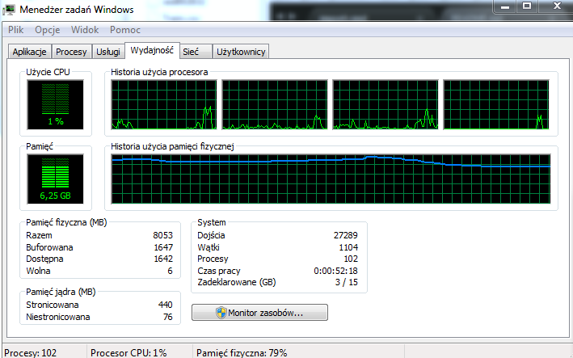

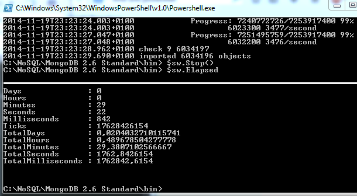  
29 minut. Dość długo.

### MongoDB 2.8.0 rc0 Storage MMAPv1

Tutaj również skorzystałem z tego samego polecenia. Nic nie trzeba było zmieniać, ponieważ tryb składowania danych MMAP jest domyślny w tej wersji mongo.

zrzuty ekranu wraz z monitorem zasobów:

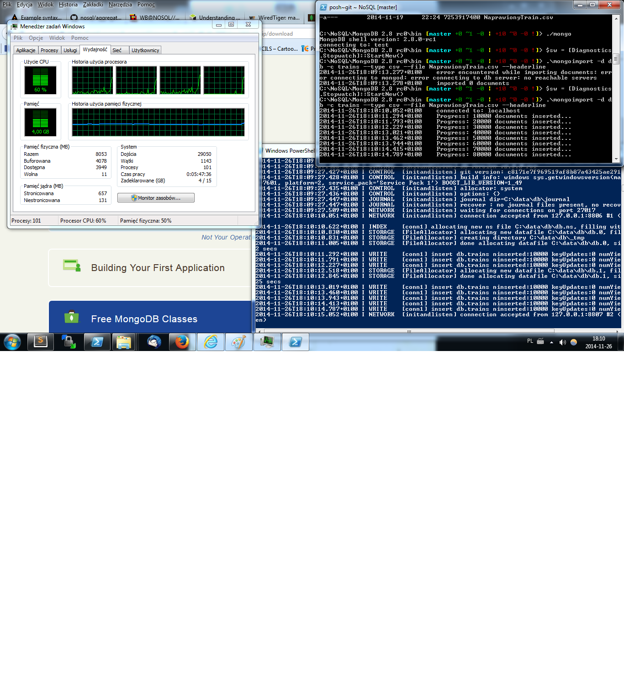
Początek importu.

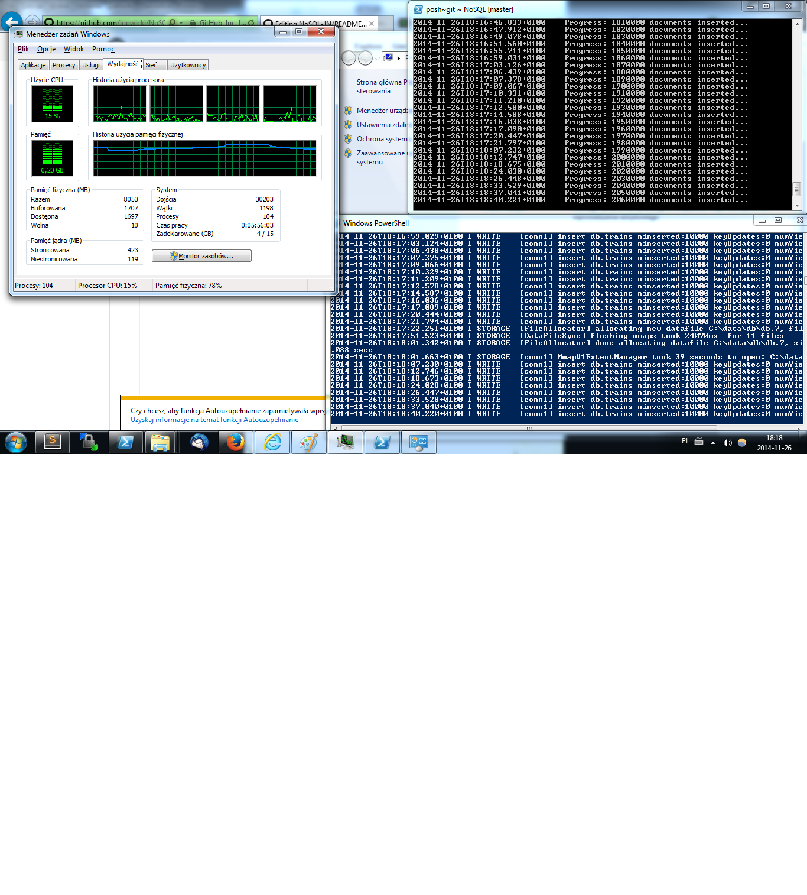
Tutaj wzrosło zużycie pamięci.

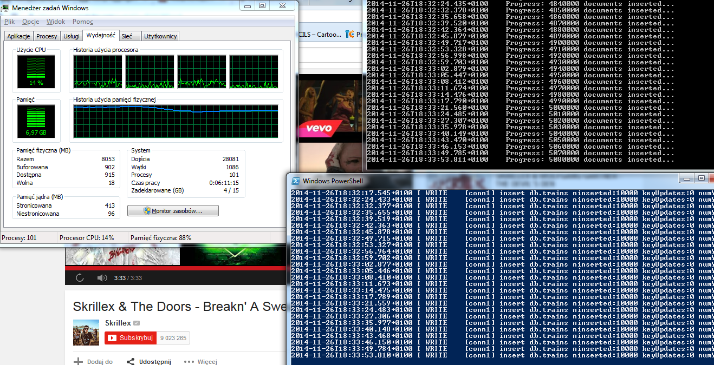
Prawie koniec.

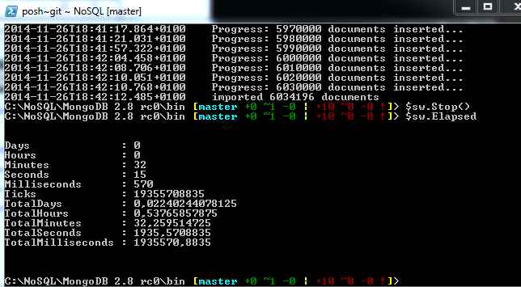 
32 minuty. 3 minuty dłużej niż MongoDB w wersji 2.6.5. Zaskoczenie lekkie, myślałem że będzie nieznacznie krócej albo tak samo.

### MongoDB 2.8.0 rc0 Storage WiredTiger

Tutaj działy się ciekawe rzeczy.

Uruchomiłem server zmodyfikowanym poleceniem:
~~~
$ ./mongod --storageEngine wiredTiger
~~~

Skrypt mierzenia czasu ten sam. Zrzuty ekranu:

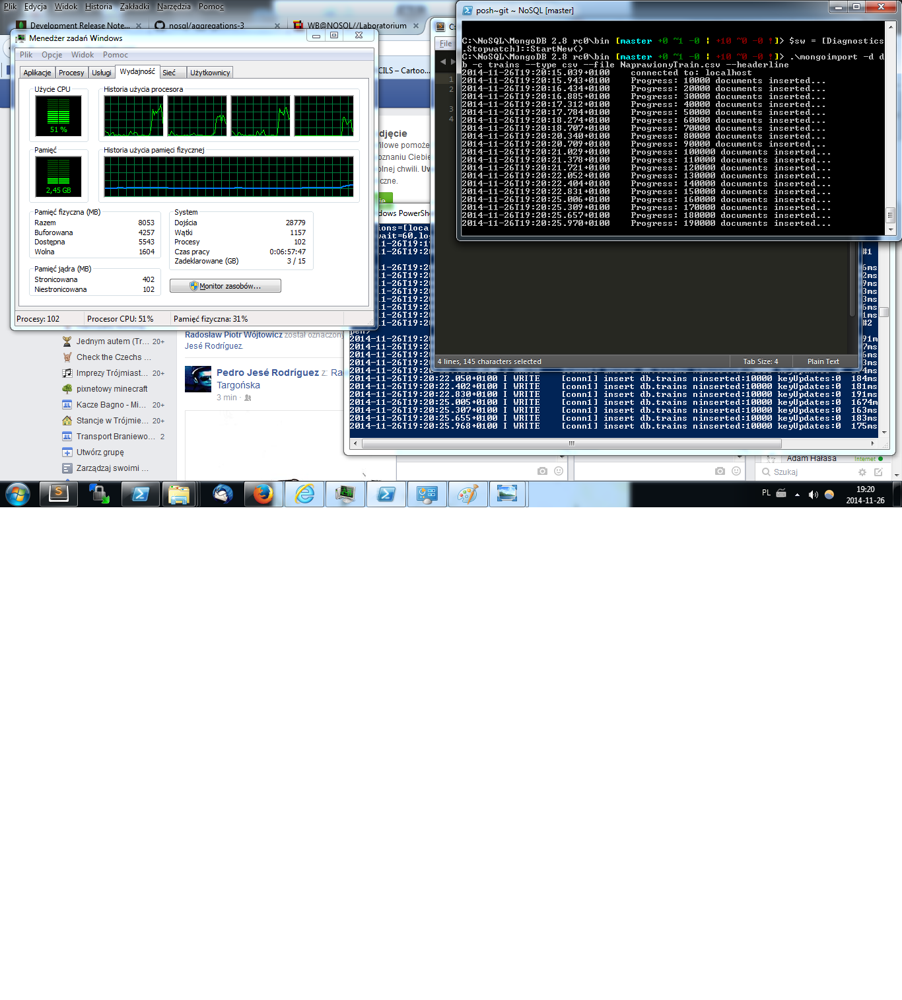
Zaczynam importowanie.

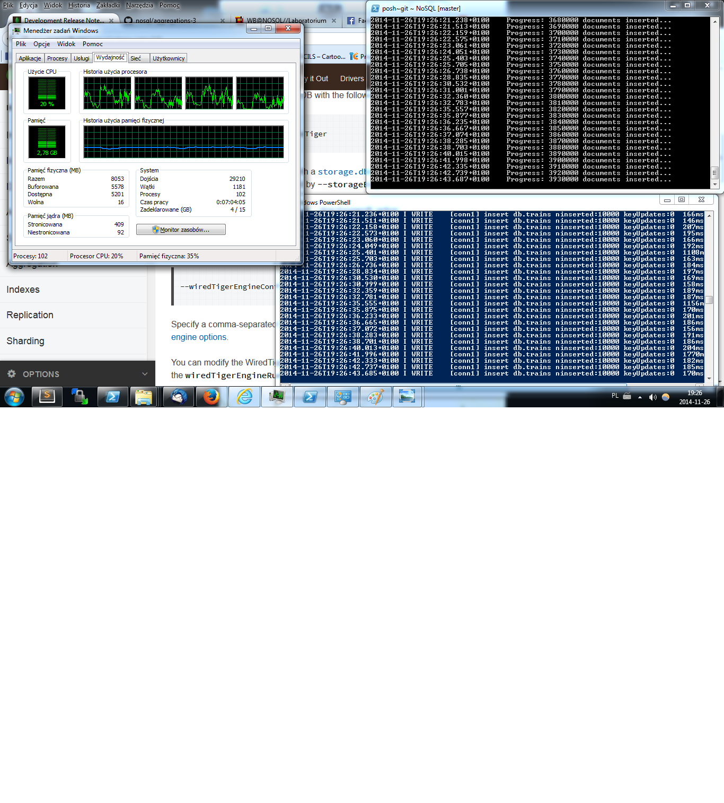
Importowanie ciąg dalszy. Poszedłem do kuchni na chwilę...

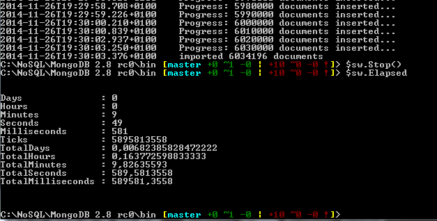 
... wracam, a tu już koniec. Zaimportowało w rekordowym czasie 9 minut i 49 sekund. Zasługa niewątpliwie dużej kompatybilności z wieloma procesorami oraz dość dużą ilością RAM, mimo że na poprzednich zrzutach nie było widać dużej ilości zużycia tych zasobów. Dowodzi to o dużej efektywności WiredTigera.

### PostgreSQL

Stworzyłem tabele i zaimportowałem dane za pomocą komendy: 
~~~
postgres=# CREATE TABLE trains (id int, title varchar(1000), body varchar(10485760), tags varchar(1000));
postgres=# COPY trains FROM 'C:\NoSQL\PostgreSQL\9.3\bin\Train.csv' DELIMITER ',' CSV HEADER;
~~~

Pomiar czasu uzyskałem za pomocą komendy /timing. Przed importowaniem musiałem również zastosować komende /encoding UTF8, ponieważ kodowanie pliku było inne niż te w psql.exe.

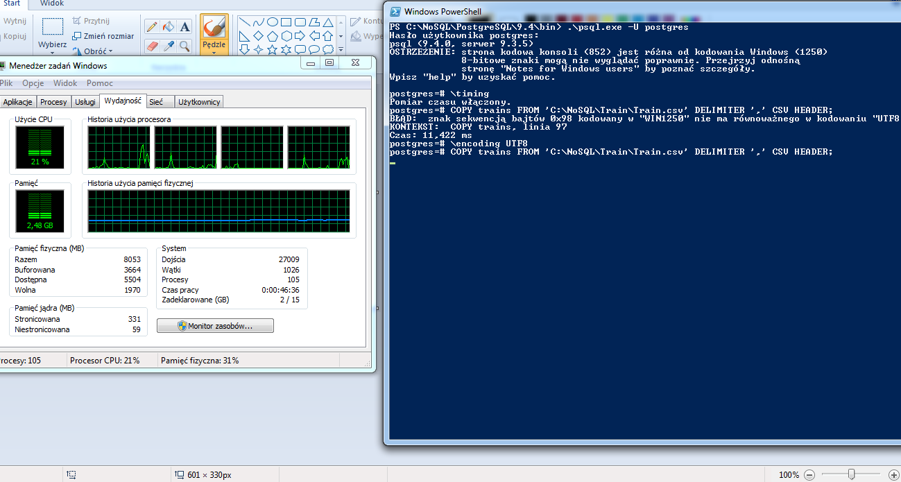  
Początek importowania. Pamięci RAM niewiele co zużyło.

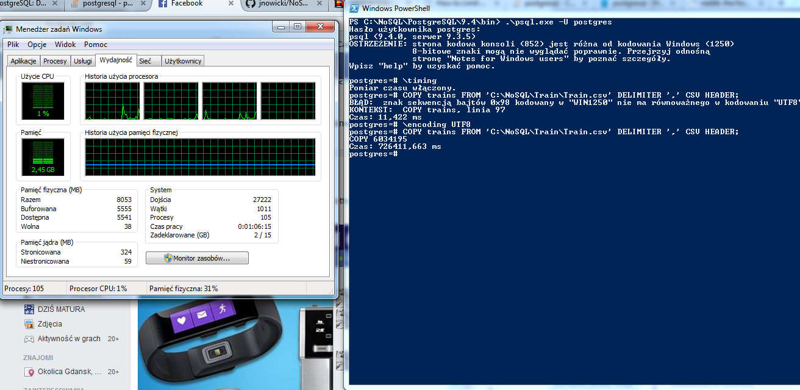  
Koniec.

Czas importu wyniósł 12 minut 6 sekund.

## 1b i rozmiar bazy

### MongoDB 2.6.5 i 2.8.0 rc0 MMS/WiredTiger

Żeby śledzić czas działania zliczania ustawiłem wbudowany profiler i użyłem funkcji count():
~~~
>db.setProfilingLevel(2)
{ "was": 0, "slowms" : 100, "ok": 1}} 
>db.trains.count()
6034196
~~~
Dygresja: Policzyło mi o jeden rekord więcej niż powinno, ponieważ w pliku CSV na końcu znalazła się pusta linia. Za późno zauważyłem pomyłkę i już nie chciało mi się poprawionego pliku CSV importować na nowo do mongo, ponieważ by miał mały wpływ na wynik. Poprawiony użyłem dopiero w imporcie do Postgres'a.

Podgląd do kolekcji system.profile dał mi czas wykonania count'a.

~~~
>db.system.profile.find().limit(10).sort( { ts : -1 } ).pretty()
~~~

2.6.5:  
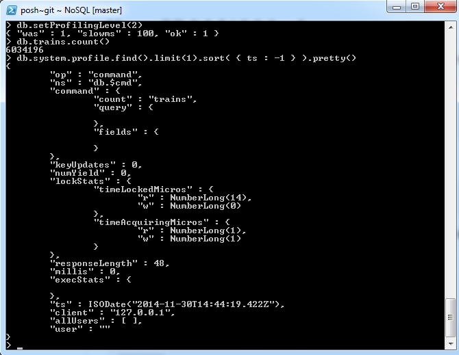  
48 ms

2.8.0 MMS:  
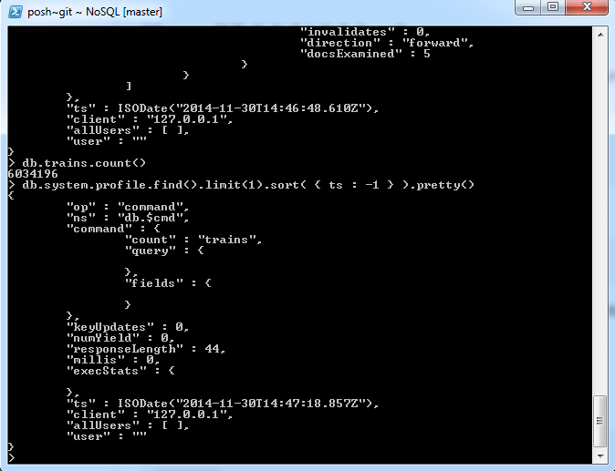  
44 ms

2.8.0 WiredTiger:  
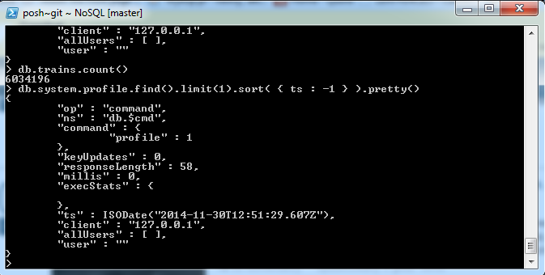  
58 ms

Rozmiar bazy sprawdziłem za pomocą komendy:

~~~
db.trains.stats()
~~~

co wyświetliło mi rozmiar bazy w bajtach, które przekonwertowałem na coś sensowniejszego.

2.6.5:  
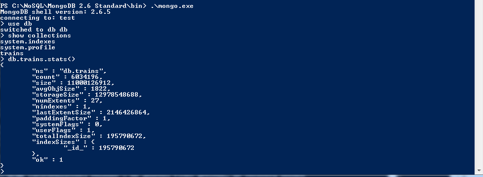  

2.8.0 MMS:  
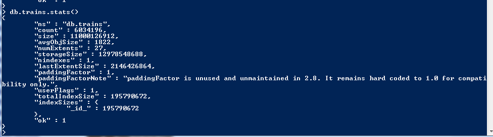  

2.8.0 WiredTiger:  
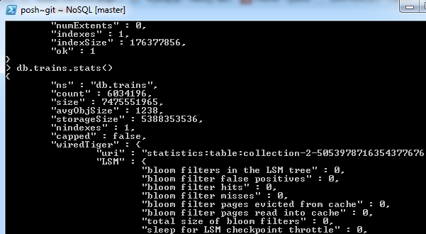  

### PostgreSQL

W postgresie użyłem zapytania:

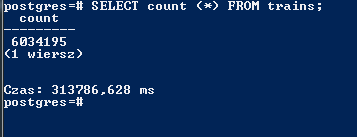  

Pomiar czasu uzyskałem tak samo jak przy imporcie. Zapytanie trwało 5 minut 13 sekund. O wiele więcej niż przy MongoDB w każdej wersji.

Rozmiar bazy sprawdziłem za pomocą komendy:

~~~
select pg_relation_size('trains');
~~~

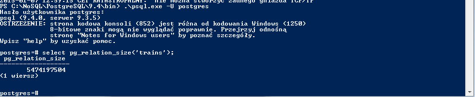  

### Tabelka podsumowująca

|                     | Import      | Count    | Size     |
|---------------------|-------------|----------|----------|
| MongoDB 2.6.5       | 29min 22sec | 48 ms    | 10.24 gb |
| MongoDB 2.8.0       | 32min 15sec | 44 ms    | 10.24 gb |
| Mongo DB WiredTiger | 9min 49sec  | 58 ms    |  6.96 gb |
| PostgreSQL          | 43min 22sec | 71000 ms |  5.12 gb |

## 1c

Snippet kodu napisany w javie do operacji w MongoDB znajduje się [tutaj](https://github.com/jnowicki/NoSQL-JN/blob/master/1c.java).

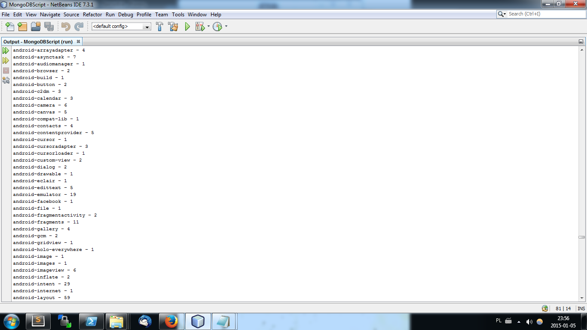  
Przykładowe dane wyjściowe dla częstotliwości wystąpień tagów.

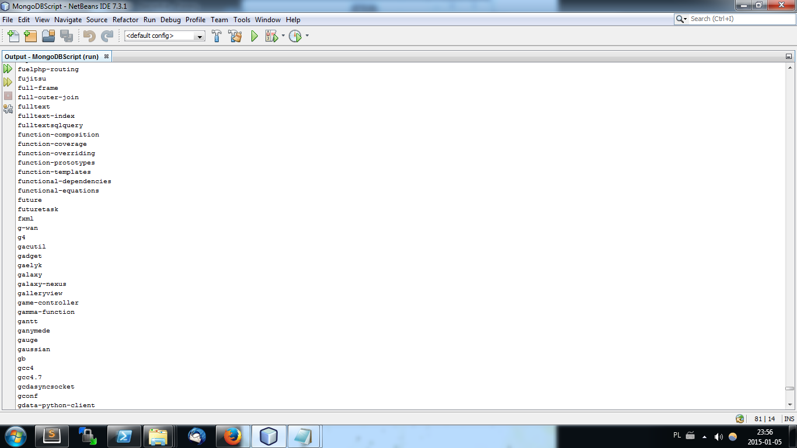  
Tutaj unikalne tagi.

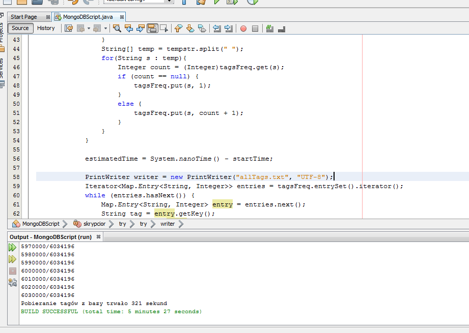  
Czas wykonania. 5 minut 21 sekund na 6034196 rekordów.
 

## 1d

[Największe zamorskie bazy wojskowe USA](maps/locMap.geojson)

### 1d.1

[Bazy wojskowe znajdujące się w azji:](maps/query1.geojson)

~~~
db.bases.find({ loc:{ $geoWithin: { $polygon: [[26.183423,39.377432],[48.331860,44.222196],[51.408032,69.166769],[99.381494,77.043528],[154.343901,68.276608],[153.289213,39.111101],[80.515777,0.722614],[42.091626,13.251471],[25.983423,40.053501],[26.183423,39.377432]]}}})
~~~

### 1d.2

Bazy wojskowe posortowane wedlug odleglosci od Washingtonu:

~~
var washington = {type: "Point", coordinates: [-77.0367, 38.8951]}
db.places.find({ loc : {$near: {$geometry: washington}}})
~~

 [!query2](screenshots/query2.png)  

### 1d.3

[Bazy wojskowe znajdujące się w promieniu 2500km od Tehranu, Iran:](maps/query3.geojson)

~~~
> db.places.find({ loc: {$near : {$geometry: {type: "Point", coordinates: [51.4231, 35.6961]}, $maxDistance: 2500000}}})
{ "_id" : "Balad", "loc" : { "type" : "Point", "coordinates" : [ 44.361572, 33.958 ] } }
{ "_id" : "Manas", "loc" : { "type" : "Point", "coordinates" : [ 74.466, 43.049 ] } }
{ "_id" : "Bezmer", "loc" : { "type" : "Point", "coordinates" : [ 26.352219, 42.454 ] } }
~~~

### 1d.4

[Zapytanie z użyciem $center i $geoWithin.](maps/query4.geojson)

~~~
> db.places.find( { loc: {$geoWithin : {$center: [[77.08, 28.7483], 45]}} })
{ "_id" : "Balad", "loc" : { "type" : "Point", "coordinates" : [ 44.361572, 33.958 ] }
{ "_id" : "Manas", "loc" : { "type" : "Point", "coordinates" : [ 74.466, 43.049 ] } }
{ "_id" : "Diego", "loc" : { "type" : "Point", "coordinates" : [ 72.407, -7.305 ] } }
~~~

### 1d.5

[Zapytanie z użyciem $box i $geoWithin.](maps/query5.geojson)

~~~
> db.places.find( { loc: {$geoWithin : {$box: [[-84.9023, 55.2743], [58.1834, -12.0394]]}} })
{ "_id" : "Balad", "loc" : { "type" : "Point", "coordinates" : [ 44.361572, 33.958 ] } }
{ "_id" : "Bezmer", "loc" : { "type" : "Point", "coordinates" : [ 26.352219, 42.454 ] } }
{ "_id" : "Guantanamo", "loc" : { "coordinates" : [ -75.209, 19.908 ], "type" : "Point" } }
~~~

### 1d.6

[Zapytanie z użyciem $polygon i $geoWithin.](maps/query6.geojson)

~~~
> db.places.find( { loc: {$geoWithin : {$polygon : [[19.072, 54.213],[96.679, 47.279],[53.964, 8.9284],[0.7031, 18.812],
[19.072, 54.213]]}} })
{ "_id" : "Balad", "loc" : { "type" : "Point", "coordinates" : [ 44.361572, 33.958 ] } }
{ "_id" : "Bezmer", "loc" : { "type" : "Point", "coordinates" : [ 26.352219, 42.454 ] } }
{ "_id" : "Manas", "loc" : { "type" : "Point", "coordinates" : [ 74.466, 43.049 ] } }
~~~

