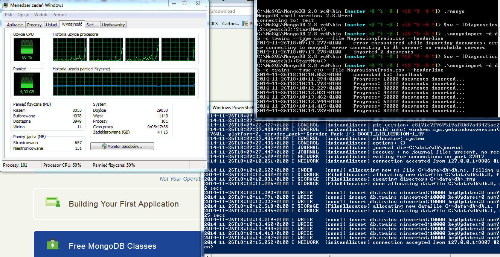
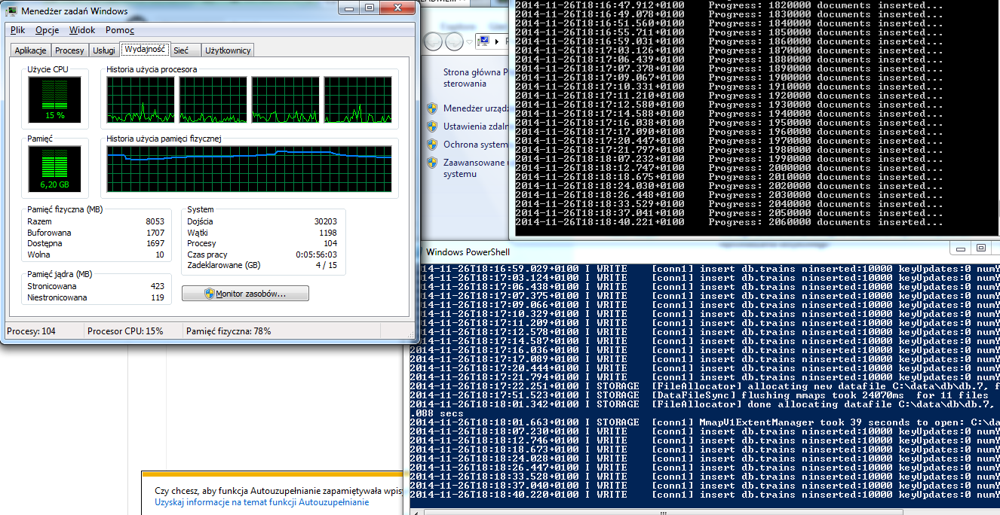
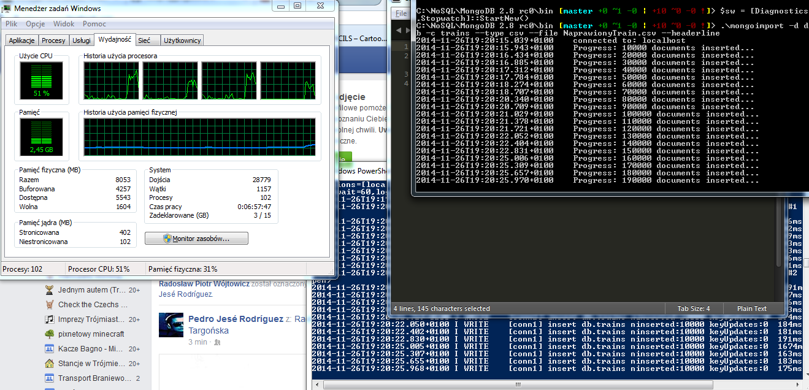

# Wstęp 
## Tytuł
Zadanie nr1, test użycia MongoDB ze storage MMAP i WiredTiger - Jakub Nowicki
## Komputer
* Procesor: Intel Core i5-3230M CPU @ 2.60GHz 4-rdzeniowy
* Pamięć RAM: 8GB (3,8 zajęte przez procesy stałe)
* Dysk Twardy: 1TB
* System Operacyjny: Windows 7 Professional SP1

## Software
* MongoDB w wersji 2.8.0 rc0 (główna)
* MongoDB w wersji 2.6.5 (do porównania)
* PostgreSQL w wersji 9.3.5

# Zadania
## 1a
Na początek trzeba poprawić plik Train.csv dla MongoDB ponieważ przejścia do nowej linii znajdują się czasem wewnątrz pól. Użyłem następującego skryptu:

~~~
$ cat Train.csv | tr "\n" " " | tr "\r" "\n" | head -n 6034196 > NaprawionyTrain.csv
~~~

następnie importy.

### MongoDB 2.6.5

Do mierzenia czasu skorzystałem z klasy .NET'owej Diagnostics.Stopwatch. Cały skrypt importowania wyglądał tak:

~~~
$sw = [Diagnostics.Stopwatch]::StartNew()
.\mongoimport -d db -c trains --type csv --file NaprawionyTrain.csv --headerline
$sw.Stop()
$sw.Elapsed
~~~

Zrzuty ekranu z monitorem systemu oraz terminalem z serverem i klientem:

Zużycie tuż po imporcie. Pamięć RAM w większości zajęta przez proces.

29 minut. Dość długo.

### MongoDB 2.8.0 rc0 Storage MMAPv1

Tutaj również skorzystałem z tego samego polecenia. Nic nie trzeba było zmieniać, ponieważ tryb składowania danych MMAP jest domyślny w tej wersji mongo.

zrzuty ekranu:

Początek importu.

Tutaj wzrosło zużycie pamięci.

Prawie koniec.

32 minuty. 3 minuty dłużej niż MongoDB w wersji 2.6.5. Zaskoczenie lekkie, myślałem że będzie nieznacznie krócej albo tak samo.

### MongoDB 2.8.0 rc0 Storage WiredTiger

Tutaj działy się ciekawe rzeczy.

Uruchomiłem server zmodyfikowanym poleceniem:
~~~
$ ./mongod --storageEngine wiredTiger
~~~

Skrypt mierzenia czasu ten sam. Zrzuty ekranu:

Zaczynam importowanie.

Importowanie ciąg dalszy. Poszedłem do kuchni na chwilę...

... wracam, a tu już koniec. Zaimportowało w rekordowym czasie 9 minut i 49 sekund. Zasługa niewątpliwie dużej kompatybilności z wieloma procesorami oraz dość dużą ilością RAM, mimo że na poprzednich zrzutach nie było widać dużej ilości zużycia tych zasobów. Dowodzi to o dużej efektywności WiredTigera.

### PostgreSQL

Stworzyłem tabele i zaimportowałem dane za pomocą komendy: 
~~~
postgres=# CREATE TABLE trains (id int, title varchar(1000), body varchar(10485760), tags varchar(1000));
postgres=# COPY trains FROM 'C:\NoSQL\PostgreSQL\9.3\bin\Train.csv' DELIMITER ',' CSV HEADER;
~~~

Czas importu wyniósł 43 minut 22 sekund.

## 1b

### MongoDB 2.6.5 i 2.8.0 rc0

Żeby śledzić czas działania zliczania ustawiłem wbudowany profiler i użyłem funkcji count():
~~~
>db.setProfilingLevel(2)
{ "was": 0, "slowms" : 100, "ok": 1}} 
>db.trains.count()
~~~
Podgląd do kolekcji system.profile dał mi czas wykonania count'a.

~~~
>db.system.profile.find().limit(10).sort( { ts : -1 } ).pretty()
~~~

Dla 2.6.5 responseLength wyniósł 44ms, dla 2.8.0 122ms a dla 2.8.0 z WiredTiger 142ms.

### PostgreSQL

### Tabelka i podsumowanie

|        | MongoDB 2.6.5 | MongoDB 2.8.0 | Mongo DB WiredTiger | PostgreSQL |
|--------|---------------|---------------|---------------------|------------|
| Import | 29min 22sec   | 32min 15sec   | 9min 49sec          |            |
| Count  | 44 ms         | 122 ms        | 142 ms              |            |

## 1c

Snippet kodu napisany w javie do komunikacji z MongoDB znajduję się [tutaj](https://github.com/jnowicki/NoSQL-JN/blob/master/1c.java).

## 1d

